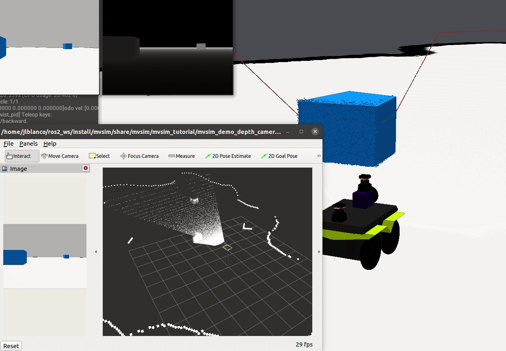

<div align="center">


# MultiVehicle Simulator (MVSim)

**Lightweight, realistic 2.5D dynamics simulator for mobile robots and multi-agent research**

[](https://github.com/MRPT/mvsim/actions/workflows/build-linux.yml) [](https://github.com/MRPT/mvsim/actions/workflows/check-clang-format.yml) [](https://mvsimulator.readthedocs.io/en/latest/?badge=latest) [](LICENSE)

[**Documentation**](https://mvsimulator.readthedocs.io) · [**Installation**](https://mvsimulator.readthedocs.io/en/latest/install.html) · [**Demo worlds**](https://mvsimulator.readthedocs.io/en/latest/demo_worlds.html) · [**Cite**](#citation)

</div>

---

## Overview

MVSim simulates wheeled robots and vehicles with realistic physics, sensors, and multi-agent support. It is designed to be **fast enough for large-scale experiments** while remaining **accurate enough for dynamics and sensor research**.

Key properties:
- Fully configured via **XML world files** — no code changes needed for most experiments.
- Works **standalone**, as a **ROS 2 node**, or embedded in a **C++ / Python** application.
- **Headless mode** for CI pipelines and Docker containers.
- Multi-vehicle worlds with mutual sensing (robots see each other in LiDAR).

https://github.com/user-attachments/assets/766db164-2d16-44f4-acbf-2f15b73c1ab3



https://github.com/user-attachments/assets/93c95aeb-71e9-4c35-b1dc-ba895c79daf7

---

## Features

### Vehicle dynamics
| Model | Description |
|---|---|
| `differential` | 2-wheel or 4-wheel differential drive (e.g. TurtleBot, Jackal) |
| `ackermann` | Car-like Ackermann steering with kinematic or dynamic control |
| `ackermann_drivetrain` | Ackermann + realistic mechanical differentials (open / Torsen, 2WD / 4WD) |
| Articulated | Trailer-style articulated vehicles |

Controllers available: **raw torque**, **twist PID**, **ideal twist**.

Friction models: **default Coulomb**, **Ward-Iagnemma** (off-road), **ellipse** (slip angle + slip ratio).

### Sensors
| Sensor | Notes |
|---|---|
| **3D LiDARs** | Velodyne VLP-16, Ouster OS1, Hesai Helios-32 (26°/31°/70° FOV) |
| **2D LiDAR** | Generic + RPLidar A2; optional GPU-based 3D ray-tracing |
| **RGB camera** | Pinhole model, configurable intrinsics |
| **RGBD camera** | Depth + color (RealSense / Xtion-style), publishes pointcloud, depth image |
| **IMU** | White noise + bias random-walk (Forster 2016 model) |
| **GNSS / GPS** | Requires georeferenced world; configurable noise |

### World elements
- Occupancy grid maps (image or MRPT binary)
- Elevation meshes (terrain with height)
- Textured 3D blocks and custom meshes (`.dae`, `.obj`)
- Friction zones (spatially-varying `mu`, rolling resistance)
- Multi-storey environments
- Lighting configuration
- Remote resource caching

### Interfaces
- **ROS 2** — full topic / TF / parameter interface (see [mvsim_node docs](https://mvsimulator.readthedocs.io/en/latest/mvsim_node.html))
- **ZMQ / Protobuf** — language-agnostic pub/sub for custom clients
- **Python** — direct API access
- **C++ library** — embed the simulator in your application

---

## Installation

### ROS 2 (recommended)

```bash
sudo apt install ros-$ROS_DISTRO-mvsim
```

Then follow the [first-steps guide](https://mvsimulator.readthedocs.io/en/latest/first-steps.html).

### Build from source

```bash
git clone https://github.com/MRPT/mvsim.git --recursive
```

See [full installation instructions](https://mvsimulator.readthedocs.io/en/latest/install.html) for cmake and colcon build options.

---

## Quick start

**Standalone:**
```bash
mvsim launch mvsim_tutorial/demo_warehouse.world.xml
mvsim launch mvsim_tutorial/demo_2robots.world.xml
mvsim launch mvsim_tutorial/demo_greenhouse.world.xml
```

**ROS 2:**
```bash
ros2 launch mvsim demo_warehouse.launch.py
ros2 launch mvsim demo_depth_camera.launch.py
```

Move the robot with `w/a/s/d` (keyboard) or any standard `cmd_vel` publisher. In multi-robot worlds, press `1`, `2`, … to select the active robot.

See [all demo worlds](https://mvsimulator.readthedocs.io/en/latest/demo_worlds.html) for the full list, including outdoor, road circuits, multi-storey, logistics center, articulated vehicles, and more.

---

## ROS 2 build status

| Distro | Dev build | Binary releases | Version |
|---|---|---|---|
| **Humble** (u22.04) | [](https://build.ros2.org/job/Hdev__mvsim__ubuntu_jammy_amd64/) | amd64 [](https://build.ros2.org/job/Hbin_uJ64__mvsim__ubuntu_jammy_amd64__binary/) arm64 [](https://build.ros2.org/job/Hbin_ujv8_uJv8__mvsim__ubuntu_jammy_arm64__binary/) | [](https://index.ros.org/?search_packages=true&pkgs=mvsim) |
| **Jazzy** (u24.04) | [](https://build.ros2.org/job/Jdev__mvsim__ubuntu_noble_amd64/) | amd64 [](https://build.ros2.org/job/Jbin_uN64__mvsim__ubuntu_noble_amd64__binary/) arm64 [](https://build.ros2.org/job/Jbin_unv8_uNv8__mvsim__ubuntu_noble_arm64__binary/) | [](https://index.ros.org/?search_packages=true&pkgs=mvsim) |
| **Kilted** (u24.04) | [](https://build.ros2.org/job/Kdev__mvsim__ubuntu_noble_amd64/) | amd64 [](https://build.ros2.org/job/Kbin_uN64__mvsim__ubuntu_noble_amd64__binary/) arm64 [](https://build.ros2.org/job/Kbin_unv8_uNv8__mvsim__ubuntu_noble_arm64__binary/) | [](https://index.ros.org/?search_packages=true&pkgs=mvsim) |
| **Rolling** (u24.04) | [](https://build.ros2.org/job/Rdev__mvsim__ubuntu_noble_amd64/) | amd64 [](https://build.ros2.org/job/Rbin_uN64__mvsim__ubuntu_noble_amd64__binary/) arm64 [](https://build.ros2.org/job/Rbin_unv8_uNv8__mvsim__ubuntu_noble_arm64__binary/) | [](https://index.ros.org/?search_packages=true&pkgs=mvsim) |

<details>
<summary>EOL distros</summary>

| Distro | Last stable version |
|---|---|
| ROS 1 Noetic (u20.04) | [](https://index.ros.org/?search_packages=true&pkgs=mvsim) |
| ROS 2 Iron (u22.04) | [](https://index.ros.org/?search_packages=true&pkgs=mvsim) |

</details>

---

## ROSCon talk

Spanish talk with English slides and subtitles ([slides](https://docs.google.com/presentation/d/1jX8t1r82vp8MIQP5u1t9bVTtG0XgmjDTtLI7z3Yamzc/edit?usp=sharing)):

[](https://www.youtube.com/watch?v=WNBqH6SWlRQ)

---

## Citation

If you use MVSim in your research, please cite:

```bibtex
@article{blanco2023mvsim,
  title   = {MultiVehicle Simulator (MVSim): Lightweight dynamics simulator for multiagents and mobile robotics research},
  journal = {SoftwareX},
  volume  = {23},
  pages   = {101443},
  year    = {2023},
  doi     = {10.1016/j.softx.2023.101443},
  url     = {https://www.sciencedirect.com/science/article/pii/S2352711023001395},
  author  = {José-Luis Blanco-Claraco and Borys Tymchenko and Francisco José Mañas-Alvarez and Fernando Cañadas-Aránega and Ángel López-Gázquez and José Carlos Moreno}
}
```

---

## License

3-clause BSD License. Copyright (C) 2014-2026 Jose Luis Blanco (University of Almeria) and contributors.
